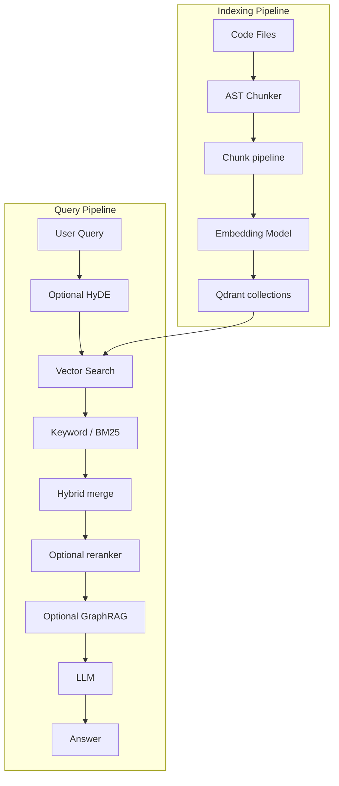
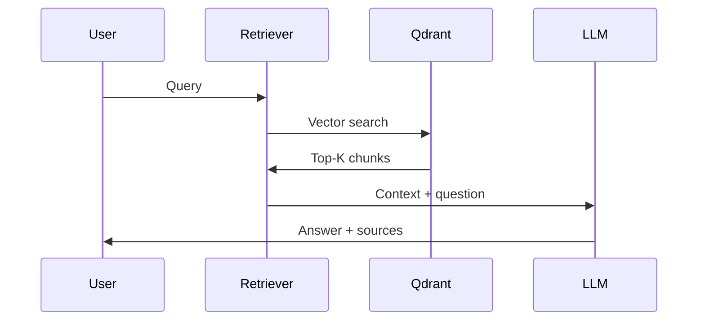

# Complete Technical Guide: Libraries, Algorithms & Implementation

**System**: Code Atlas  
**Vector store**: **Qdrant** (embedded, on-disk via `qdrant-client`)  
**Last Updated**: 2026-04

For setup and paths, see **[`DEVELOPER_ONBOARDING.md`](DEVELOPER_ONBOARDING.md)** and **[`SELF_HOSTING.md`](SELF_HOSTING.md)**.

---

## Table of Contents

1. [Libraries & Dependencies](#libraries--dependencies)
2. [System Overview](#system-overview)
3. [Models Used](#models-used)
4. [Algorithms & Techniques](#algorithms--techniques)
5. [End-to-End Flow](#end-to-end-flow)
6. [Data Flow](#data-flow)
7. [Architecture Diagrams](#architecture-diagrams)
8. [Mathematical Foundations](#mathematical-foundations)
9. [Performance Characteristics](#performance-characteristics)
10. [Setup & Vector Store](#setup--vector-store)
11. [Tool Implementations](#tool-implementations)
12. [Papers & Further Reading](#papers--further-reading)
13. [Summary](#summary)

---

## Libraries & Dependencies

### Core Libraries

| Library | Version | Purpose |
|---------|---------|---------|
| `qdrant-client` | 1.7+ | Embedded Qdrant (`path=`) for code vectors (HNSW-backed search) |
| `requests` / `httpx` | 2.31+ | HTTP for Ollama, GitLab API |
| `concurrent.futures` | stdlib | Parallel Git tasks and search |
| `subprocess` | stdlib | Git operations |
| `http.server` | stdlib | REST API server in `search_api` |
| `json` / `pathlib` | stdlib | Config, file operations |
| `re` | stdlib | Regex chunking fallback |
| `logging` | stdlib | Structured logging |
| `threading` | stdlib | Daemon mode, API server |

### AI Libraries (Optional / Recommended)

| Library | Version | Purpose |
|---------|---------|---------|
| `sentence-transformers` | 2.2+ | Embeddings (MiniLM, Jina) and cross-encoder reranking |
| `tree-sitter` | 0.20+ | AST parsing for Go/Python/Java/JS chunking |
| `openai`, `anthropic`, `google-generativeai` | various | Cloud LLMs |
| `ollama` (server) | 0.1+ | Local LLMs |

### Design Notes

- API layer uses **stdlib** `http.server` (no mandatory Flask/FastAPI for the default server).
- **Vector DB**: Qdrant embedded under `data/qdrant_db` (or `QDRANT_PATH`) — see `src/ai/vector_backend.py`.
- **Search**: Custom hybrid pipeline (vector + BM25-style keyword scoring where implemented).

---

## System Overview

**What Code Atlas Does**

- Indexes many Git repositories (Go, Python, JavaScript, …).
- **Semantic code search** via embeddings + Qdrant vector search.
- **RAG** for natural-language answers over retrieved chunks.
- Parallel Git/GitLab automation, REST API, optional web dashboard.

**Core Technologies**

- **Vector database**: Qdrant (HNSW index per collection; embedded mode).
- **Embeddings**: Default **all-MiniLM-L6-v2** (384 dim) or upgrades via `src/ai/embeddings/advanced.py` (Jina, CodeBERT, OpenAI).
- **LLMs**: Ollama (local), OpenAI, Anthropic, Gemini (config-driven).
- **RAG**: Custom retriever + query engine (`src/ai/rag.py`, `query_engine.py`, etc.).

---

## Models Used

### 1. Embedding Models

#### A. Default Local (384 dimensions)

- **Model**: `all-MiniLM-L6-v2` (sentence-transformers).
- **Use**: Fast baseline; no API cost.
- **Typical path**: indexer / retriever loads the model and writes vectors to Qdrant.

#### B. Jina Embeddings v2 Base Code (768 dimensions)

- **Model**: `jinaai/jina-embeddings-v2-base-code`
- **Context**: up to 8k tokens; code-oriented.

#### C. CodeBERT (768 dimensions)

- **Model**: `microsoft/codebert-base`

#### D. OpenAI Embeddings

- **Model**: e.g. `text-embedding-3-small` (1536 dim) when configured.

**Implementation reference**: `src/ai/embeddings/advanced.py` (`AdvancedEmbeddingModel`).

### 2. Reranking (Optional)

- Cross-encoder such as **BAAI/bge-reranker-v2-m3** when enabled in config.

### 3. LLMs

- Configured in `config/ai_config.json` + environment keys: OpenAI, Anthropic, Gemini, Ollama.

---

## Algorithms & Techniques

### HNSW (Approximate Nearest Neighbors)

Qdrant uses **HNSW** for dense vector search: logarithmic-time approximate NN in high dimensions. Parameters (`M`, `ef_construct`, etc.) are managed by Qdrant collection settings and client APIs — tune via Qdrant docs when scaling.

### Hybrid Retrieval

- **Dense**: cosine similarity in embedding space (Qdrant).
- **Sparse / keyword**: BM25 or similar scoring where wired in `rag` / `rag_enhanced`.
- **Fusion**: combine scores for ranked results.

### HyDE, GraphRAG, Deep Context

Optional pipeline stages (when enabled): hypothetical document expansion, graph-aware expansion, richer context before the LLM — see `query_engine` and related modules.

### AST Chunking

Structure-aware splits via **tree-sitter** where available; regex fallback otherwise.

---

## End-to-End Flow

1. **Index**: Walk repo files → chunk (AST or fallback) → embed → upsert to **Qdrant** collections (often per-repo or unified collection depending on scripts).
2. **Query**: Embed query → vector search in Qdrant → optional keyword/hybrid merge → optional rerank → optional graph/context expansion → LLM answer.

Key files: `scripts/index_*.py`, `src/ai/vector_backend.py`, `src/ai/vector_db.py`, `src/ai/rag.py`, `src/ai/query_engine.py`.

---

## Data Flow

```
┌─────────────────────────────────────────────────────────────┐
│                    INDEXING PHASE                           │
└─────────────────────────────────────────────────────────────┘

Code Files (Go/Python/JS)
    ↓
[AST Parser] → Parse structure
    ↓
Function/Class Chunks
    ↓
[Parent-Child / chunking pipeline]
    ↓
[Embedding Model] → Generate vectors
    ↓
[Qdrant HNSW] → Index vectors
    ↓
Vector Database (ready for search)


┌─────────────────────────────────────────────────────────────┐
│                    QUERY PHASE                              │
└─────────────────────────────────────────────────────────────┘

User Question
    ↓
[Optional HyDE] → Expanded query text
    ↓
[Vector Search] → Qdrant HNSW search
    ↓
[BM25 / keyword] → Scoring where implemented
    ↓
[Hybrid / merge] → Combined ranking
    ↓
[Optional reranker]
    ↓
[Optional GraphRAG / deep context]
    ↓
[LLM] → Answer + sources
```

---

## Architecture Diagrams

### System Architecture



### RAG Pipeline (Conceptual)



---

## Mathematical Foundations

### Cosine Similarity

```
similarity(A, B) = (A · B) / (||A|| × ||B||)
```

### BM25 (When Used)

Classic probabilistic scoring over term statistics; implementation details live in the retrieval modules.

### Cross-Encoder Reranking

Scores `(query, document)` jointly with a transformer; higher precision than bi-encoder similarity alone for top-K reranking.

---

## Performance Characteristics

### Time Complexity (Typical)

| Operation | Complexity | Notes |
|-----------|------------|-------|
| HNSW index build | O(N log N) | Indexing |
| HNSW search | O(log N) approximate | Per query |
| BM25 | Depends on corpus scan | Implementation-specific |
| LLM generation | O(tokens) | Dominates latency for “Ask” |

### Space

Vectors: `N × D × 4` bytes (float32), plus Qdrant HNSW graph overhead and metadata per point.

---

## Setup & Vector Store

### Dependencies

```bash
pip install -r requirements.txt
pip install -r requirements-ai.txt   # Qdrant + embeddings + LLM clients
```

### Embedded Qdrant

```python
from qdrant_client import QdrantClient

client = QdrantClient(path="./data/qdrant_db")
```

Prefer **`open_embedded_qdrant_client`** in `src/ai/vector_backend.py` for consistent paths and lock error messages.

Environment: **`QDRANT_PATH`** overrides the default `./data/qdrant_db`.

**Important**: Only one process should open the same embedded path at a time (exclusive lock). For concurrent readers/writers, run **Qdrant as a server** and use URL mode.

---

## Tool Implementations

### Built-in Tools (Overview)

| # | Tool | File | Approach |
|---|------|------|----------|
| 1 | **Code Search** | `src/ai/rag.py` | Qdrant vector search + hybrid / keyword boost (as implemented) |
| 2 | **REST API** | `src/api/search_api.py` | HTTP server, multiple endpoints |
| 3 | **Web Dashboard** | `src/api/dashboard.py` | HTML/CSS/JS front end |
| 4 | **Slack Bot** | `src/tools/slack_bot.py` | Events API |
| 5 | **PR Auto-Reviewer** | `src/tools/pr_reviewer.py` | Static analysis + RAG + LLM |
| 6 | **Duplication Finder** | `src/tools/duplication_finder.py` | Embedding distance across chunks |
| 7 | **Dependency Scanner** | `src/tools/dependency_scanner.py` | Manifest parsing |
| 8 | **Migration Automator** | `src/tools/migration_automator.py` | Parallel replace + git |
| 9 | **Doc Generator** | `src/tools/doc_generator.py` | RAG-assisted summaries |
| 10 | **Test Generator** | `src/tools/test_generator.py` | Stub generation |
| 11 | **Incident Debugger** | `src/tools/incident_debugger.py` | Stack trace + RAG |
| 12 | **Refactoring Engine** | `src/tools/refactoring_engine.py` | Parallel edits per repo |

### Query-Time Optimizations (Conceptual)

| Idea | Benefit |
|------|---------|
| Embed query once | Avoid repeated encoder work across repos |
| Unified index (`build_unified_index.py`) | Single search over merged collection when built |
| Warm embedding model | Reduce first-query latency |

---

## Papers & Further Reading

1. **HNSW**: Malkov & Yashunin — hierarchical navigable small-world graphs for ANN.
2. **HyDE**: Gao et al. — hypothetical documents for zero-shot retrieval.
3. **BM25**: Robertson et al. — probabilistic ranking.
4. **Sentence-BERT**: Reimers & Gurevych — sentence embeddings.

**Implementations to study**

- **Qdrant**: https://github.com/qdrant/qdrant  
- **Sentence Transformers**: https://www.sbert.net/

---

## Summary

| Layer | Choice |
|-------|--------|
| **Embeddings** | MiniLM (384d) default; Jina / CodeBERT / OpenAI optional |
| **Vector DB** | Qdrant embedded (`qdrant-client`) |
| **Retrieval** | Dense + optional keyword/hybrid + optional rerank |
| **LLM** | Multi-provider via config |

**Pipeline**: Code → chunk → embed → **Qdrant** → query → retrieve → (optional) rerank / graph / LLM → answer.

---

## Document history

This guide was rewritten in 2026 to match the **Qdrant-only** codebase and remove obsolete vector-store material.
