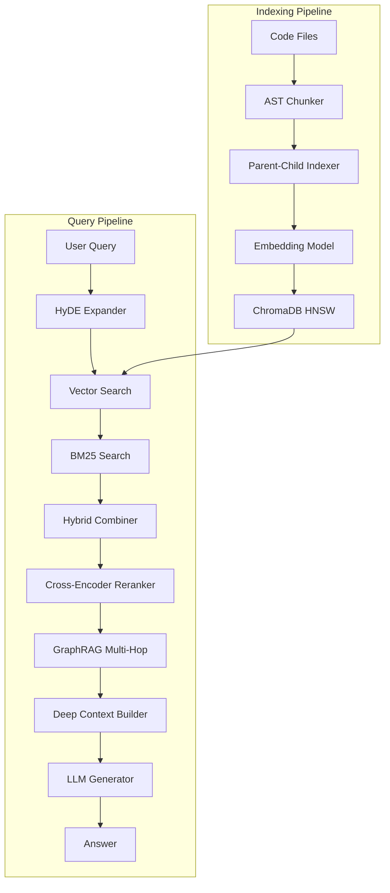
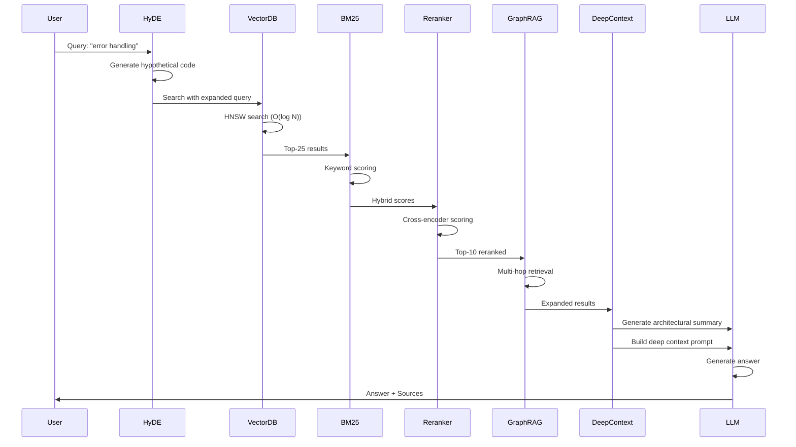
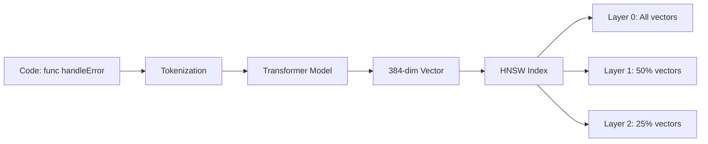

# Complete Technical Guide: Libraries, Algorithms & Implementation

**System**: Code Atlas  
**Last Updated**: 2026-02-09

---

## Table of Contents

1. [Libraries & Dependencies](#libraries--dependencies)
2. [System Overview](#system-overview)
3. [Models Used](#models-used)
4. [Algorithms & Techniques](#algorithms--techniques)
5. [End-to-End Implementation](#end-to-end-implementation)
6. [Data Flow](#data-flow)
7. [Architecture Diagrams](#architecture-diagrams)
8. [Tool Implementations](#tool-implementations)

---

## Libraries & Dependencies

### Core Libraries

| Library | Version | Purpose |
|---------|---------|---------|
| `chromadb` | 0.4+ | Vector database for code embeddings (HNSW index) |
| `requests` | 2.31+ | HTTP client for Ollama, GitLab API |
| `concurrent.futures` | stdlib | Parallel execution of Git tasks and search |
| `subprocess` | stdlib | Git operations (checkout, commit, push) |
| `http.server` | stdlib | REST API server (no external framework needed) |
| `json` / `pathlib` | stdlib | Config parsing, file operations |
| `re` | stdlib | Regex-based code chunking fallback |
| `logging` | stdlib | JSONL structured logging |
| `threading` | stdlib | Daemon mode, API server |

### AI Libraries (Optional)

| Library | Version | Purpose |
|---------|---------|---------|
| `sentence-transformers` | 2.2+ | Cross-encoder reranking (BAAI/bge-reranker-v2-m3) |
| `tree-sitter` | 0.20+ | AST parsing for Go/Python/Java/JS code chunking |
| `openai` | 1.0+ | OpenAI GPT-4o-mini API |
| `anthropic` | 0.18+ | Claude 3.5 Sonnet API |
| `google-generativeai` | 0.3+ | Gemini 2.0 Flash API |
| `ollama` (server) | 0.1+ | Local LLMs (codellama, mistral, deepseek-coder) |

### No Heavy Dependencies

The system is designed to run with **zero external frameworks**:
- API: `http.server` (stdlib) - no Flask/FastAPI
- DB: ChromaDB (embedded, no separate server)
- LLM: Ollama (local, free) - no API keys required
- Search: Pure Python BM25 implementation - no elasticsearch

---

## System Overview

**What We Built**: An AI-powered codebase management system that:
- Indexes 73+ Git repositories (Go, Python, JavaScript)
- Enables semantic code search using vector databases
- Answers natural language questions using RAG (Retrieval-Augmented Generation)
- Reviews code, finds duplicates, generates docs/tests, debugs errors
- Automates Git operations across multiple repos in parallel
- Serves a web dashboard and REST API

**Core Technologies**:
- **Vector Database**: ChromaDB (HNSW index)
- **Embeddings**: ChromaDB default (384 dim) -> Upgradable to Jina/CodeBERT (768-1536 dim)
- **LLMs**: Ollama (local, free), OpenAI GPT-4o-mini, Claude 3.5 Sonnet, Gemini 2.0 Flash
- **RAG Framework**: Custom implementation with advanced optimizations

---

## 🤖 Models Used

### 1. **Embedding Models**

#### **A. ChromaDB Default Embedding** (Current)
- **Model**: `all-MiniLM-L6-v2` (inferred from ChromaDB defaults)
- **Dimensions**: 384
- **Type**: General-purpose text embedding
- **Context Window**: ~512 tokens
- **Pros**: Fast, local, no API costs
- **Cons**: Not code-specific, smaller dimensions

**How It Works**:
```python
# ChromaDB automatically embeds when you add documents
collection.add(
    documents=["func handleError(err error) { ... }"],
    metadatas=[{"repo": "example-app", "file": "error.go"}]
)
# Internally: text → tokenization → transformer → 384-dim vector
```

#### **B. Jina Embeddings v2 Base Code** (Upgrade Option)
- **Model**: `jinaai/jina-embeddings-v2-base-code`
- **Dimensions**: 768
- **Type**: Code-specific embedding
- **Context Window**: 8,000 tokens
- **Training**: Trained on code datasets
- **Pros**: Better semantic understanding of code structure

**Implementation**:
```python
from sentence_transformers import SentenceTransformer

model = SentenceTransformer('jinaai/jina-embeddings-v2-base-code')
embedding = model.encode("func handleError(err error) { ... }")
# Returns: numpy array of shape (768,)
```

#### **C. CodeBERT** (Alternative)
- **Model**: `microsoft/codebert-base`
- **Dimensions**: 768
- **Type**: Code-specific (trained on CodeSearchNet)
- **Architecture**: RoBERTa-based
- **Pros**: Excellent for code understanding

#### **D. OpenAI Embeddings** (High Quality)
- **Model**: `text-embedding-3-small`
- **Dimensions**: 1536
- **Type**: General-purpose (but high quality)
- **Pros**: Very high quality, large dimensions
- **Cons**: Requires API calls, costs money

---

### 2. **Reranking Models**

#### **A. BAAI/bge-reranker-v2-m3** (Recommended)
- **Type**: Cross-encoder
- **Architecture**: BERT-based
- **Input**: Query + Document pair
- **Output**: Relevance score (0-1)
- **Why**: Sees query and document together (more accurate than vector similarity)

**How It Works**:
```python
from sentence_transformers import CrossEncoder

reranker = CrossEncoder('BAAI/bge-reranker-v2-m3')

# Score a query-document pair
query = "error handling function"
document = "func handleError(err error) { ... }"
score = reranker.predict([[query, document]])  # Returns: [0.85]
# Higher score = more relevant
```

**Algorithm**:
1. Tokenize query + document together
2. Pass through BERT encoder
3. Pool embeddings (CLS token)
4. Linear layer → single score
5. Sigmoid → 0-1 relevance probability

#### **B. Simple Keyword Reranker** (Fallback)
- **Type**: TF-IDF + keyword matching
- **Algorithm**: Count exact keyword matches, weight by position
- **Pros**: Fast, no model needed
- **Cons**: Less accurate than cross-encoder

---

### 3. **LLM Models**

#### **A. OpenAI GPT-4o-mini** (Default)
- **Context Window**: 128K tokens
- **Cost**: $0.15/$0.60 per 1M tokens (input/output)
- **Best For**: Code generation, general Q&A
- **Strengths**: Fast, cost-effective, good code understanding

#### **B. Anthropic Claude 3.5 Sonnet**
- **Context Window**: 200K tokens
- **Cost**: $3/$15 per 1M tokens
- **Best For**: Complex reasoning, code review
- **Strengths**: Excellent reasoning, follows instructions well

#### **C. Google Gemini 2.0 Flash**
- **Context Window**: 1M tokens
- **Cost**: Free tier available, then $0.075/$0.30 per 1M tokens
- **Best For**: Large context, cost optimization
- **Strengths**: Very large context, fast

#### **D. Ollama (Local LLM)** ⭐ **NEW - FREE!**
- **Models**: `codellama`, `llama2`, `mistral`, `deepseek-coder`, etc.
- **Context Window**: Varies by model (typically 4K-32K tokens)
- **Cost**: **$0** (runs locally, no API costs!)
- **Best For**: Privacy, offline use, no API budget, high-volume usage
- **Strengths**: Free, private, no rate limits, customizable
- **Setup**: Install Ollama → `ollama pull codellama` → Use!

**Recommended Models**:
- `codellama` (7B) - Best for code, ~4GB RAM
- `deepseek-coder` (6.7B) - Code-focused, efficient
- `codellama:13b` - Better quality, ~8GB RAM

**Model Selection Strategy**:
```python
# Fallback chain: Try Ollama (local, free) first, then API providers
fallback_chain = ["ollama", "openai", "anthropic", "gemini"]

# Task-based routing:
if task == "code_generation":
    use = "openai"  # Fast, good for code
elif task == "code_review":
    use = "anthropic"  # Better reasoning
elif task == "simple":
    use = "gemini"  # Cheapest
elif no_api_keys:
    use = "ollama"  # Free local fallback
```

**Ollama Integration**:
- Automatically detected if Ollama server is running
- **Tried FIRST** in fallback chain (before API providers)
- Perfect for: No API budget, privacy, offline development
- Setup: `ollama serve` → `ollama pull codellama` → Ready!

---

## 🧮 Algorithms & Techniques

### 1. **HNSW (Hierarchical Navigable Small World)**

**What**: ChromaDB's underlying vector index algorithm

**How It Works**:
```
1. Build a graph where:
   - Nodes = vectors (code chunks)
   - Edges = similarity connections

2. Create multiple layers:
   - Layer 0: All vectors (dense graph)
   - Layer 1: 50% of vectors (sparser)
   - Layer 2: 25% of vectors (even sparser)
   - ... (logarithmic reduction)

3. Search algorithm:
   - Start at top layer (few nodes)
   - Find nearest neighbor
   - Move down layers, refining search
   - At bottom layer, return top-k results

4. Complexity:
   - Build: O(N log N)
   - Search: O(log N) - much faster than brute force!
```

**Parameters** (ChromaDB defaults):
- `M`: 16 (connections per node)
- `ef_construction`: 200 (search width during build)
- `ef_search`: 50 (search width during query)

**Why Fast**: Logarithmic search instead of linear scan

---

### 2. **AST-Based Chunking Algorithm**

**Problem**: Simple line-based chunking splits functions in half, losing context

**Solution**: Parse code structure, chunk at function/class boundaries

**Algorithm**:

#### **Tree-Sitter Approach** (Best):
```
1. Parse code → Abstract Syntax Tree (AST)
   Example Go code:
   ```
   func handleError(err error) {
       if err != nil {
           log.Error(err)
       }
   }
   ```
   
   AST Structure:
   ```
   function_declaration
   ├── identifier: "handleError"
   ├── parameters: (err error)
   └── block
       └── if_statement
           └── block
               └── call_expression: log.Error
   ```

2. Traverse AST:
   - Find all function_declaration nodes
   - Extract each function as a chunk
   - Preserve imports/package at top

3. Result: Clean chunks, no mid-function splits
```

#### **Regex Fallback** (When tree-sitter unavailable):
```
1. Scan lines for function patterns:
   - Go: "func " or "func("
   - Python: "def " or "class "
   - JavaScript: "function " or "const x = ("

2. Track brace/indent balance:
   - Go: Count { and }
   - Python: Track indentation level
   - JavaScript: Count { and }

3. When balance returns to 0:
   - Function ended
   - Save as chunk

4. Result: Function-aware chunks (less precise than AST)
```

**Code Example**:
```python
def chunk_go_regex(content, lines):
    chunks = []
    current_chunk = []
    brace_count = 0
    
    for i, line in enumerate(lines):
        # Detect function start
        if re.match(r'^func\s+', line.strip()):
            if current_chunk:
                chunks.append('\n'.join(current_chunk))
            current_chunk = [line]
            brace_count = line.count('{') - line.count('}')
        else:
            current_chunk.append(line)
            brace_count += line.count('{') - line.count('}')
            
            # Function ends when braces balance
            if brace_count == 0:
                chunks.append('\n'.join(current_chunk))
                current_chunk = []
    
    return chunks
```

---

### 3. **Parent-Child Indexing Algorithm**

**Problem**: Small chunks are good for matching, but LLM needs full context

**Solution**: Store both child (precise) and parent (contextual) chunks

**Algorithm**:
```
For each function chunk:
  1. Child Chunk:
     - The function itself
     - Small, precise
     - Used for vector search (better matching)
  
  2. Parent Chunk:
     - Child + imports + surrounding context
     - Larger, complete context
     - Used for LLM input (better understanding)

Example:
  Child: "func handleError(err error) { ... }"
  Parent: 
    "package main
     import \"fmt\"
     import \"log\"
     
     func handleError(err error) {
         if err != nil {
             log.Error(err)
         }
     }
     
     // Related function below..."
```

**Search Flow**:
```
1. Vector search finds child chunks (precise match)
2. Retrieve parent chunk for each child
3. Send parent chunks to LLM (full context)
4. LLM sees complete function + dependencies
```

---

### 4. **HyDE (Hypothetical Document Embeddings)**

**Problem**: "English queries" don't match "code embeddings" well

**Solution**: Generate hypothetical code, then search code-to-code

**Algorithm**:
```
Step 1: User Query
  "How do I handle HTTP errors?"

Step 2: LLM Generates Hypothetical Code
  Prompt: "Generate code that answers: How do I handle HTTP errors?"
  
  LLM Output:
  ```go
  func handleHTTPError(w http.ResponseWriter, err error) {
      if err != nil {
          http.Error(w, err.Error(), http.StatusInternalServerError)
          return
      }
  }
  ```

Step 3: Search Using Hypothetical Code
  - Embed the hypothetical code
  - Search vector DB with code embedding
  - "Code matches code" better than "English matches code"

Step 4: Combine Results
  - Original query (semantic)
  + Hypothetical code (structural)
  = Better matches
```

**Why It Works**:
- Code embeddings are trained on code structure
- Code-to-code similarity > text-to-code similarity
- Hypothetical code captures intent in code form

---

### 5. **BM25 Algorithm** (Keyword Search)

**What**: Best Matching 25 - probabilistic ranking function

**Formula**:
```
BM25(q, d) = Σ IDF(qi) × (f(qi, d) × (k1 + 1)) / (f(qi, d) + k1 × (1 - b + b × |d|/avgdl))

Where:
- q = query terms
- d = document
- f(qi, d) = term frequency of qi in d
- |d| = document length
- avgdl = average document length
- k1 = 1.5 (term frequency saturation)
- b = 0.75 (length normalization)
- IDF(qi) = log((N - df(qi) + 0.5) / (df(qi) + 0.5))
  - N = total documents
  - df(qi) = documents containing qi
```

**How It Works**:
```
1. Tokenize query: "error handling" → ["error", "handling"]

2. For each document:
   - Count how many times "error" appears
   - Count how many times "handling" appears
   - Calculate IDF (rarer terms = higher weight)
   - Apply BM25 formula

3. Rank by score (higher = more relevant)

Example:
  Query: "error handling"
  
  Doc 1: "func handleError(err error) { ... }"
    - "error" appears 1 time
    - "handling" doesn't appear
    - Score: 2.3
  
  Doc 2: "func processData(data string) { ... }"
    - Neither term appears
    - Score: 0.0
  
  Result: Doc 1 ranks higher
```

**Why Use BM25**:
- Fast (no neural network)
- Exact keyword matching
- Complements semantic search (catches what vectors miss)

---

### 6. **Hybrid Search Algorithm**

**Combines**: BM25 (keyword) + Vector Search (semantic)

**Algorithm**:
```
1. Run BM25 search → Get top-k with BM25 scores
2. Run Vector search → Get top-k with distance scores
3. Normalize scores to 0-1 range:
   - BM25: score / max_score
   - Vector: 1 / (1 + distance)  # Convert distance to similarity

4. Combine with weighted average:
   hybrid_score = (bm25_score × 0.3) + (vector_score × 0.7)
   
   Why 0.3/0.7?
   - Vector search is more powerful (semantic understanding)
   - BM25 catches exact matches vector search might miss
   - 30% keyword + 70% semantic = balanced

5. Sort by hybrid_score
6. Return top-k results
```

**Example**:
```
Query: "error handling"

BM25 Results:
  Doc A: score=3.2 → normalized=1.0
  Doc B: score=2.1 → normalized=0.66

Vector Results:
  Doc A: distance=0.3 → similarity=0.77
  Doc C: distance=0.1 → similarity=0.91

Hybrid Scores:
  Doc A: (1.0 × 0.3) + (0.77 × 0.7) = 0.84
  Doc C: (0.0 × 0.3) + (0.91 × 0.7) = 0.64
  Doc B: (0.66 × 0.3) + (0.5 × 0.7) = 0.55

Final Ranking: A > C > B
```

---

### 7. **Cross-Encoder Reranking Algorithm**

**Problem**: Vector search is fast but "fuzzy" - might miss best matches

**Solution**: Re-score top-k results using a model that sees query + document together

**Algorithm**:
```
1. Vector search returns top-25 candidates
   (Fast, but approximate)

2. For each candidate:
   - Create pair: [query, document]
   - Pass through cross-encoder:
     ```
     Input: ["error handling", "func handleError(err error) { ... }"]
     ↓
     BERT Encoder (sees both together)
     ↓
     CLS Token Embedding
     ↓
     Linear Layer
     ↓
     Sigmoid
     ↓
     Output: 0.92 (relevance score)
     ```

3. Sort by rerank_score (higher = more relevant)

4. Return top-k reranked results
```

**Why Better**:
- **Bi-encoder** (vector search): Encodes query and document separately
  - Fast, but loses interaction information
  
- **Cross-encoder** (reranking): Encodes query + document together
  - Slower, but sees relationships
  - "error handling" + "handleError" → understands connection

**Performance**:
- Vector search: ~10ms for 1000 docs
- Reranking: ~50ms for 25 docs
- Combined: Best of both (fast initial search + accurate reranking)

---

### 8. **GraphRAG Multi-Hop Retrieval**

**Problem**: Finding one function isn't enough - need to understand dependencies

**Solution**: Build knowledge graph, traverse relationships

**Algorithm**:
```
1. Build Graph During Indexing:
   Nodes:
   - Files: "example-app/error.go"
   - Functions: "handleError"
   
   Edges:
   - Import: "error.go" → imports → "log.go"
   - Call: "handleError" → calls → "log.Error"
   - Define: "error.go" → defines → "handleError"

2. Vector Search Finds Initial Match:
   Query: "error handling"
   → Finds: "handleError" function

3. Multi-Hop Retrieval:
   Step 1: Found "handleError"
   Step 2: Follow edges:
     - Get imports: "log.go"
     - Get called functions: "log.Error"
   Step 3: Retrieve those too
   
   Result: Complete context chain
   - handleError (found)
   - log.Error (called by handleError)
   - log.go (imported by error.go)
```

**Graph Structure**:
```
example-app/error.go
├── imports → example-app/log.go
├── defines → handleError()
│   └── calls → log.Error()
└── defines → processError()
    └── calls → handleError()
```

**Traversal Algorithm**:
```python
def multi_hop_retrieve(initial_results, hops=1):
    expanded = list(initial_results)
    seen = set()
    
    for result in initial_results:
        file = result['file']
        
        # Hop 1: Get imports
        imports = graph.get_imports(file)
        for imp in imports:
            if imp not in seen:
                expanded.append(get_chunks_from_file(imp))
                seen.add(imp)
        
        # Hop 2: Get functions that call this function
        callers = graph.get_callers(result['function'])
        for caller in callers:
            expanded.append(get_chunk(caller))
    
    return expanded
```

---

### 9. **Deep Context: Architectural Summary**

**Problem**: LLM sees code snippets but doesn't understand relationships

**Solution**: Generate architectural summary before sending to LLM

**Algorithm**:
```
Step 1: Retrieve Top 10 Code Snippets
  Via: Vector search → Reranking → GraphRAG

Step 2: Generate Architectural Summary
  Prompt to LLM:
  """
  Analyze these code snippets:
  
  Snippet 1: example-app/error.go - handleError()
  Snippet 2: example-app/log.go - log.Error()
  Snippet 3: example-app/http.go - HTTPErrorHandler()
  
  Explain:
  1. How they relate
  2. What patterns they represent
  3. How they work together
  """
  
  LLM Output:
  """
  These snippets form an error handling architecture:
  - handleError() is the main error handler
  - It uses log.Error() for logging
  - HTTPErrorHandler wraps handleError() for HTTP contexts
  - Pattern: Centralized error handling with logging
  """

Step 3: Build Deep Context Prompt
  """
  ## Architectural Context
  [Summary from Step 2]
  
  ## Code Snippets
  [All 10 snippets]
  
  ## Question
  [User's question]
  """

Step 4: LLM Generates Answer
  - Has architectural understanding
  - Sees how code fits together
  - Better reasoning about relationships
```

**Why Better**:
- LLM understands "why" not just "what"
- Sees patterns and relationships
- Can reason about architecture

---

## 🔄 End-to-End Implementation

### **Phase 1: Indexing (Code → Vectors)**

#### **Step 1.1: Discover Repositories**
```python
# scripts/auto_discover_repos.py
def discover_repos(base_path):
    repos = []
    for dir in os.listdir(base_path):
        if os.path.exists(f"{dir}/.git"):
            repos.append({
                "name": dir,
                "path": f"{base_path}/{dir}",
                "gitlab_url": get_git_remote_url(dir)
            })
    return repos
```

**Output**: List of repository paths

---

#### **Step 1.2: Load Code Files**
```python
# scripts/index_one_repo.py
def load_code_files(repo_path):
    files = []
    for ext in ['.go', '.py', '.js']:
        for file in repo_path.rglob(f"*{ext}"):
            if '.git' in str(file):
                continue
            with open(file) as f:
                content = f.read()
            files.append((file, content, ext[1:]))  # (path, content, language)
    return files
```

**Output**: List of (file_path, content, language) tuples

---

#### **Step 1.3: Chunk Code (AST-Based)**
```python
# src/ai/chunking/ast_chunker.py
def chunk_code(content, language):
    chunker = ASTChunker()
    
    # Parse AST
    if language == 'go':
        # Use tree-sitter or regex
        ast_chunks = chunker.chunk(content, language="go")
    
    # Each chunk is a function/class
    return ast_chunks
```

**Algorithm**:
1. Parse code → AST
2. Extract function/class nodes
3. Each node = one chunk
4. Preserve structure (no mid-function splits)

**Output**: List of code chunks with metadata

---

#### **Step 1.4: Create Parent-Child Pairs**
```python
# src/ai/chunking/parent_child.py
def create_parent_child_chunks(content, language, file_path, repo_name):
    indexer = ParentChildIndexer()
    
    # Get AST chunks
    ast_chunks = chunker.chunk(content, language)
    
    pairs = []
    for chunk in ast_chunks:
        # Child: The chunk itself
        child_code = chunk['code']
        
        # Parent: Child + imports + context
        parent_code = (
            extract_imports(content) +
            context_before(chunk) +
            child_code +
            context_after(chunk)
        )
        
        pairs.append(ParentChildChunk(
            child_code=child_code,
            parent_code=parent_code,
            metadata={...}
        ))
    
    return pairs
```

**Output**: Parent-child chunk pairs

---

#### **Step 1.5: Generate Embeddings**
```python
# ChromaDB does this automatically
collection.add(
    documents=[chunk.code for chunk in chunks],
    metadatas=[chunk.metadata for chunk in chunks],
    ids=[chunk.id for chunk in chunks]
)

# Internally ChromaDB:
# 1. Tokenizes each document
# 2. Passes through embedding model (all-MiniLM-L6-v2)
# 3. Generates 384-dim vector
# 4. Stores in HNSW index
```

**What Happens**:
```
Code: "func handleError(err error) { ... }"
  ↓
Tokenization: ["func", "handleError", "(", "err", "error", ...]
  ↓
Embedding Model (Transformer):
  - Input: Tokens
  - Output: 384-dim vector
  - Example: [0.23, -0.45, 0.67, ..., 0.12]
  ↓
HNSW Index:
  - Insert vector into graph
  - Connect to similar vectors
  - Build hierarchical layers
```

**Output**: Vectors stored in ChromaDB

---

### **Phase 2: Query Processing (Question → Answer)**

#### **Step 2.1: User Asks Question**
```
Input: "How do I handle HTTP errors?"
```

---

#### **Step 2.2: HyDE Query Expansion** (Optional)
```python
# src/ai/hyde.py
def expand_query(query, language):
    # Ask LLM to generate hypothetical code
    prompt = f"Generate code that answers: {query}"
    
    hypothetical_code = llm.generate(prompt)
    # Output: "func handleHTTPError(w http.ResponseWriter, err error) { ... }"
    
    # Combine original + hypothetical
    expanded = f"{query}\n\nHypothetical code:\n{hypothetical_code}"
    return expanded
```

**Output**: Expanded query with hypothetical code

---

#### **Step 2.3: Vector Search**
```python
# src/ai/rag.py
def search_code(query, n_results=10):
    # Embed query
    query_vector = embed(query)  # 384-dim vector
    
    # Search HNSW index
    results = collection.query(
        query_embeddings=[query_vector],
        n_results=n_results
    )
    
    # Returns: Top-k similar code chunks
    return results
```

**HNSW Search Algorithm**:
```
1. Start at top layer (few nodes)
2. Find entry point (random or heuristic)
3. Greedy search for nearest neighbor
4. Move down to next layer
5. Refine search at each layer
6. At bottom layer, return top-k

Complexity: O(log N) instead of O(N)
```

**Output**: Top-k code chunks with similarity distances

---

#### **Step 2.4: Hybrid Search** (BM25 + Vector)
```python
# src/ai/hybrid_search.py
def hybrid_search(query, vector_results):
    # Extract documents from vector results
    documents = [r['code'] for r in vector_results]
    
    # BM25 search
    bm25 = BM25()
    bm25.index(documents)
    bm25_results = bm25.search(query, top_k=len(documents))
    
    # Combine scores
    for i, result in enumerate(vector_results):
        vector_score = 1 / (1 + result['distance'])
        bm25_score = get_bm25_score(i, bm25_results)
        
        result['hybrid_score'] = (bm25_score * 0.3) + (vector_score * 0.7)
    
    # Sort by hybrid score
    return sorted(vector_results, key=lambda x: x['hybrid_score'], reverse=True)
```

**Output**: Reranked results with hybrid scores

---

#### **Step 2.5: Cross-Encoder Reranking** (Optional)
```python
# src/ai/reranking.py
def rerank(query, candidates):
    reranker = CrossEncoder('BAAI/bge-reranker-v2-m3')
    
    # Score each query-document pair
    pairs = [[query, c['code']] for c in candidates]
    scores = reranker.predict(pairs)
    
    # Add scores
    for i, candidate in enumerate(candidates):
        candidate['rerank_score'] = scores[i]
    
    # Sort by rerank score
    return sorted(candidates, key=lambda x: x['rerank_score'], reverse=True)
```

**Output**: Top-k reranked results (more accurate)

---

#### **Step 2.6: GraphRAG Multi-Hop** (Optional)
```python
# src/ai/graphrag.py
def multi_hop_retrieve(initial_results):
    expanded = list(initial_results)
    
    for result in initial_results:
        file = result['file']
        
        # Get imports
        imports = graph.get_imports(file)
        for imp in imports:
            expanded.append(get_chunks_from_file(imp))
        
        # Get callers
        function = result.get('function')
        if function:
            callers = graph.get_callers(function)
            for caller in callers:
                expanded.append(get_chunk(caller))
    
    return expanded
```

**Output**: Expanded results with related code

---

#### **Step 2.7: Build Context**
```python
# src/ai/rag.py
def build_context(query, results, max_length=6000):
    context_parts = []
    total_length = 0
    
    for result in results:
        snippet = f"--- {result['repo']}/{result['file']} ---\n{result['code']}\n"
        
        if total_length + len(snippet) > max_length:
            break
        
        context_parts.append(snippet)
        total_length += len(snippet)
    
    return "\n".join(context_parts)
```

**Output**: Formatted context string

---

#### **Step 2.8: Generate Architectural Summary** (Optional)
```python
# src/ai/deep_context.py
def build_architectural_summary(snippets, query):
    # Ask LLM to analyze relationships
    prompt = f"""
    Analyze these code snippets and explain their relationships:
    {format_snippets(snippets)}
    
    Query: {query}
    
    Provide architectural summary.
    """
    
    summary = llm.generate(prompt)
    return summary
```

**Output**: Architectural summary explaining relationships

---

#### **Step 2.9: Build Deep Context Prompt**
```python
# src/ai/deep_context.py
def build_deep_context_prompt(query, snippets, summary):
    prompt = f"""
    ## Architectural Context
    {summary}
    
    ## Relevant Code
    {format_snippets(snippets)}
    
    ## Question
    {query}
    """
    return prompt
```

**Output**: Complete prompt with context + summary

---

#### **Step 2.10: LLM Generation**
```python
# src/ai/llm/manager.py
def generate(prompt, system_prompt):
    # Select model (fallback chain)
    for provider in ["openai", "anthropic", "gemini"]:
        try:
            response = provider.generate(
                prompt=prompt,
                system_prompt=system_prompt,
                temperature=0.3,
                max_tokens=4000
            )
            return response
        except:
            continue
    
    raise RuntimeError("All providers failed")
```

**LLM Processing**:
```
Input Prompt:
  """
  ## Architectural Context
  [Summary]
  
  ## Relevant Code
  [Code snippets]
  
  ## Question
  How do I handle HTTP errors?
  """

  ↓
  
Tokenization:
  ["##", "Architectural", "Context", ...]
  
  ↓
  
Transformer Processing:
  - Self-attention (understands relationships)
  - Cross-attention (relates question to code)
  - Feed-forward (generates answer)
  
  ↓
  
Output Generation (Token by token):
  "Based" → "on" → "the" → "code" → "in" → "example-app/error.go" → ...
  
  ↓
  
Final Answer:
  "Based on the code in example-app/error.go, error handling works by..."
```

**Output**: Natural language answer with code references

---

#### **Step 2.11: Format Response**
```python
# src/ai/query_engine.py
def format_answer(result):
    output = []
    output.append(result.answer)
    output.append("\n📚 Sources:")
    for src in result.sources:
        output.append(f"  - {src['repo']}/{src['file']}")
    output.append(f"\n⚡ {result.provider} | {result.tokens_used} tokens")
    return "\n".join(output)
```

**Output**: Formatted answer with sources

---

## 📊 Complete Data Flow

```
┌─────────────────────────────────────────────────────────────┐
│                    INDEXING PHASE                           │
└─────────────────────────────────────────────────────────────┘

Code Files (Go/Python/JS)
    ↓
[AST Parser] → Parse structure
    ↓
Function/Class Chunks
    ↓
[Parent-Child Indexer] → Create pairs
    ↓
Child Chunks (precise) + Parent Chunks (context)
    ↓
[Embedding Model] → Generate vectors
    ↓
[ChromaDB HNSW] → Index vectors
    ↓
Vector Database (Ready for search)


┌─────────────────────────────────────────────────────────────┐
│                    QUERY PHASE                              │
└─────────────────────────────────────────────────────────────┘

User Question: "How do I handle errors?"
    ↓
[HyDE] → Generate hypothetical code (optional)
    ↓
Expanded Query
    ↓
[Vector Search] → HNSW search (O(log N))
    ↓
Top-25 Candidates
    ↓
[BM25] → Keyword scoring
    ↓
[Hybrid Search] → Combine BM25 + Vector scores
    ↓
Top-10 Hybrid Results
    ↓
[Cross-Encoder Reranking] → Re-score pairs (optional)
    ↓
Top-5 Reranked Results
    ↓
[GraphRAG] → Multi-hop retrieval (optional)
    ↓
Expanded Results (with imports/callers)
    ↓
[Deep Context] → Generate architectural summary (optional)
    ↓
Context + Summary
    ↓
[LLM] → Generate answer
    ↓
Answer + Sources
```

---

## 🏗️ Architecture Diagrams

### **System Architecture**



### **RAG Pipeline Detail**



### **Embedding & Indexing Flow**



---

## 🔢 Mathematical Foundations

### **1. Cosine Similarity** (Vector Search)

```
similarity(A, B) = (A · B) / (||A|| × ||B||)

Where:
- A · B = dot product
- ||A|| = L2 norm (magnitude)

Example:
  Query vector: [0.5, 0.3, 0.8, ...]
  Doc vector:   [0.4, 0.2, 0.9, ...]
  
  Dot product: 0.5×0.4 + 0.3×0.2 + 0.8×0.9 + ... = 1.2
  Norms: ||A|| = 1.0, ||B|| = 1.0
  Similarity: 1.2 / (1.0 × 1.0) = 0.92
  
  Higher = more similar (max = 1.0)
```

### **2. BM25 Formula**

```
BM25(q, d) = Σ IDF(qi) × (f(qi, d) × (k1 + 1)) / (f(qi, d) + k1 × (1 - b + b × |d|/avgdl))

Components:
- IDF(qi): Inverse Document Frequency
  = log((N - df(qi) + 0.5) / (df(qi) + 0.5))
  - Higher for rare terms
  
- f(qi, d): Term frequency in document
  - How many times term appears
  
- |d|/avgdl: Length normalization
  - Prevents long documents from dominating
  
- k1 = 1.5: Term frequency saturation
  - Prevents very frequent terms from dominating
  
- b = 0.75: Length normalization factor
```

### **3. Cross-Encoder Scoring**

```
score = sigmoid(W · BERT([CLS; query; SEP; document; SEP]))

Where:
- BERT encodes query + document together
- CLS token = [CLS] (classification token)
- SEP = [SEP] (separator token)
- W = learned weight matrix
- sigmoid = converts to 0-1 probability
```

---

## 📈 Performance Characteristics

### **Time Complexity**

| Operation | Complexity | Notes |
|-----------|------------|-------|
| **HNSW Build** | O(N log N) | One-time indexing cost |
| **HNSW Search** | O(log N) | Very fast, logarithmic |
| **BM25 Search** | O(N × M) | N=docs, M=query terms |
| **Reranking** | O(K) | K=number of candidates (usually 25) |
| **HyDE** | O(1) | Single LLM call |
| **GraphRAG** | O(E) | E=edges traversed (usually <10) |
| **LLM Generation** | O(T) | T=output tokens (usually 500-2000) |

**Total Query Time** (typical):
- Vector search: ~10ms
- BM25: ~5ms
- Reranking: ~50ms
- GraphRAG: ~10ms
- HyDE: ~200ms (LLM call)
- Deep Context: ~300ms (LLM call)
- Final LLM: ~1000ms

**Total**: ~1.5-2 seconds (with all optimizations)

---

### **Space Complexity**

| Component | Space | Notes |
|-----------|-------|-------|
| **Vectors** | N × D × 4 bytes | N=chunks, D=dimensions (384) |
| **HNSW Index** | N × M × 4 bytes | M=connections (16) |
| **Metadata** | ~100 bytes/chunk | Repo, file, language info |
| **Graph** | E × 8 bytes | E=edges (imports, calls) |

**Example** (73 repos, 4058 chunks):
- Vectors: 4058 × 384 × 4 = ~6 MB
- HNSW: 4058 × 16 × 4 = ~260 KB
- Metadata: 4058 × 100 = ~400 KB
- **Total**: ~7 MB (very efficient!)

---

## 🎯 Step-by-Step Implementation Guide

### **Step 1: Setup Environment**

```bash
# Install dependencies
pip install chromadb langchain openai anthropic google-generativeai
pip install tree-sitter sentence-transformers  # Optional but recommended

# Set API keys
export OPENAI_API_KEY=sk-...
export ANTHROPIC_API_KEY=sk-ant-...
export GEMINI_API_KEY=AI...
```

---

### **Step 2: Initialize Vector Database**

```python
# src/ai/vector_db.py
import chromadb

client = chromadb.PersistentClient(path="./data/vector_db")
collection = client.create_collection(name="code_snippets")
```

**What Happens**:
- Creates directory: `./data/vector_db/`
- Initializes HNSW index
- Sets up embedding function (default: all-MiniLM-L6-v2)

---

### **Step 3: Index a Repository**

```python
# scripts/index_one_repo.py
from src.ai.chunking import ASTChunker, ParentChildIndexer
from src.ai.vector_db import VectorDB

# 1. Load files
files = load_code_files(repo_path)

# 2. Chunk with AST
chunker = ASTChunker()
indexer = ParentChildIndexer()

all_chunks = []
for file_path, content, language in files:
    # AST chunking
    ast_chunks = chunker.chunk(content, language)
    
    # Parent-child pairs
    pc_chunks = indexer.create_parent_child_chunks(
        content, language, file_path, repo_name
    )
    
    all_chunks.extend(pc_chunks)

# 3. Add to vector DB
db = VectorDB(collection_name=f"repo_{repo_name}")
for chunk in all_chunks:
    # Add child chunk
    db.add_documents(
        documents=[chunk.child_code],
        metadatas=[chunk.child_metadata],
        ids=[f"{chunk.child_metadata['repo']}_{chunk.child_metadata['file']}_child"]
    )
    
    # Add parent chunk
    db.add_documents(
        documents=[chunk.parent_code],
        metadatas=[chunk.parent_metadata],
        ids=[f"{chunk.parent_metadata['repo']}_{chunk.parent_metadata['file']}_parent"]
    )
```

**What Happens**:
1. Files loaded → 2. AST parsed → 3. Chunks created → 4. Embeddings generated → 5. Vectors indexed

---

### **Step 4: Search Code**

```python
# src/ai/rag_enhanced.py
from src.ai.rag_enhanced import EnhancedRAGRetriever

rag = EnhancedRAGRetriever(
    use_hyde=True,
    use_reranking=True,
    use_hybrid_search=True
)

results = rag.search_code("error handling", n_results=10)
```

**What Happens**:
1. HyDE expands query → 2. Vector search → 3. BM25 search → 4. Hybrid combine → 5. Rerank → 6. Return results

---

### **Step 5: Query with LLM**

```python
# src/ai/query_engine.py
from src.ai.query_engine import QueryEngine

engine = QueryEngine(use_enhanced_rag=True)
result = engine.query("How do I handle HTTP errors?")
```

**What Happens**:
1. Search code → 2. Build context → 3. Generate summary → 4. Build prompt → 5. LLM generates → 6. Return answer

---

## 🔍 Detailed Algorithm Explanations

### **HNSW Search Algorithm** (Step-by-Step)

```
Input: Query vector q, Top-k = 5

Step 1: Start at top layer
  - Layer 2: Only 25% of vectors (sparse)
  - Find entry point (random or heuristic)

Step 2: Greedy search at top layer
  - Start from entry point
  - Check neighbors
  - Move to closest neighbor
  - Repeat until no closer neighbor found
  - Result: Approximate nearest neighbor at top layer

Step 3: Move down to next layer
  - Use result from Step 2 as entry point
  - Layer 1: 50% of vectors (more dense)

Step 4: Refine search at Layer 1
  - Greedy search from entry point
  - More vectors = more accurate

Step 5: Move to bottom layer
  - Layer 0: All vectors (dense)
  - Final refinement

Step 6: Return top-k
  - Keep k nearest neighbors
  - Return with distances
```

**Why Fast**: Logarithmic layers mean we only search ~log(N) nodes instead of N nodes

---

### **BM25 Scoring Example**

```
Query: "error handling"
Documents:
  Doc 1: "func handleError(err error) { log.Error(err) }"
  Doc 2: "func processData(data string) { return data }"

Step 1: Tokenize query
  Terms: ["error", "handling"]

Step 2: Calculate IDF
  N = 2 (total documents)
  
  "error":
    - Appears in Doc 1: Yes
    - df("error") = 1
    - IDF = log((2 - 1 + 0.5) / (1 + 0.5)) = log(1.5/1.5) = 0
  
  "handling":
    - Appears in: None
    - df("handling") = 0
    - IDF = log((2 - 0 + 0.5) / (0 + 0.5)) = log(2.5/0.5) = log(5) = 1.61

Step 3: Calculate BM25 for Doc 1
  Terms in Doc 1: ["func", "handleError", "err", "error", "log", "Error", "err"]
  
  "error":
    - tf = 1 (appears once)
    - doc_len = 7 (7 terms)
    - avgdl = 6.5 (average doc length)
    - Score = 0 × (1 × 2.5) / (1 + 1.5 × (1 - 0.75 + 0.75 × 7/6.5))
    - Score = 0 (IDF is 0, term is too common)
  
  "handling":
    - tf = 0 (doesn't appear)
    - Score = 0
  
  Total BM25(Doc 1) = 0

Step 4: Calculate BM25 for Doc 2
  "error": tf = 0 → Score = 0
  "handling": tf = 0 → Score = 0
  Total BM25(Doc 2) = 0

Note: This example shows why BM25 alone isn't enough - 
need semantic search (vector) to find "handleError" for "error handling"
```

---

### **Cross-Encoder Reranking Example**

```
Query: "error handling"
Candidates:
  C1: "func handleError(err error) { ... }"
  C2: "func processData(data string) { ... }"
  C3: "func logError(msg string) { ... }"

Step 1: Create pairs
  P1 = ["error handling", "func handleError(err error) { ... }"]
  P2 = ["error handling", "func processData(data string) { ... }"]
  P3 = ["error handling", "func logError(msg string) { ... }"]

Step 2: Pass through cross-encoder
  Model: BAAI/bge-reranker-v2-m3
  
  Input P1:
    [CLS] error handling [SEP] func handleError(err error) { ... } [SEP]
    ↓
    BERT Encoder (sees both together)
    ↓
    Attention: "error" attends to "handleError" and "err"
    ↓
    CLS embedding: [0.8, 0.2, 0.5, ...]
    ↓
    Linear layer: W · CLS
    ↓
    Sigmoid: 0.92
  
  Scores:
    C1: 0.92 (high - "handleError" matches "error handling")
    C2: 0.15 (low - "processData" doesn't match)
    C3: 0.68 (medium - "logError" somewhat related)

Step 3: Rerank
  Final order: C1 > C3 > C2
```

---

## 📚 Key Concepts Explained

### **1. Why Vector Search?**

**Traditional Search** (keyword-based):
- "error handling" → finds documents with exact words
- Misses: "handleError", "errorHandler", "catch exceptions"

**Vector Search** (semantic):
- "error handling" → finds semantically similar code
- Finds: "handleError", "catchError", "processException"
- Understands meaning, not just keywords

### **2. Why Reranking?**

**Vector Search**:
- Fast (O(log N))
- But approximate (might miss best match)

**Reranking**:
- Slow (O(K) where K=25)
- But exact (sees query + document together)

**Combined**: Fast initial search + accurate reranking = Best of both

### **3. Why Parent-Child?**

**Child Chunk** (small):
- "func handleError(err error) { log.Error(err) }"
- Good for matching (precise)

**Parent Chunk** (large):
- "package main\nimport \"log\"\n\nfunc handleError(err error) {\n    log.Error(err)\n}\n\n// Related code..."
- Good for LLM (full context)

**Result**: Precise matching + complete understanding

### **4. Why HyDE?**

**Problem**: 
- User asks in English: "error handling"
- Code is in Go: "handleError"
- English embedding ≠ Code embedding

**Solution**:
- Generate hypothetical code: "func handleError(err error)"
- Search code-to-code
- Code embeddings match better than English-to-code

---

## 🎓 Learning Resources

### **Papers & Research**:

1. **HNSW**: "Efficient and robust approximate nearest neighbor search using Hierarchical Navigable Small World graphs"
   - Authors: Malkov, Yury A., and Dmitry A. Yashunin
   - Key insight: Logarithmic search via hierarchical graphs

2. **HyDE**: "Precise Zero-Shot Dense Retrieval without Relevance Labels"
   - Authors: Gao, Luyu, et al.
   - Key insight: Hypothetical documents improve retrieval

3. **BM25**: "Okapi BM25: A Non-binary Model"
   - Authors: Robertson, Stephen, et al.
   - Key insight: Probabilistic ranking function

4. **Cross-Encoders**: "Sentence-BERT: Sentence Embeddings using Siamese BERT-Networks"
   - Authors: Reimers, Nils, and Iryna Gurevych
   - Key insight: Cross-encoders see query+document together

### **Implementations to Study**:

- **ChromaDB**: https://github.com/chroma-core/chroma
- **LangChain RAG**: https://python.langchain.com/docs/use_cases/question_answering/
- **Sentence Transformers**: https://www.sbert.net/

---

## ✅ Summary

### **Models**:
- **Embeddings**: ChromaDB default (384 dim) → Upgradable to Jina/CodeBERT (768-1536 dim)
- **Reranking**: BAAI/bge-reranker-v2-m3 (cross-encoder)
- **LLMs**: GPT-4o-mini, Claude 3.5 Sonnet, Gemini 2.0 Flash

### **Algorithms**:
- **HNSW**: Logarithmic vector search
- **AST Chunking**: Structure-aware code splitting
- **BM25**: Probabilistic keyword ranking
- **HyDE**: Hypothetical document generation
- **Cross-Encoder**: Query-document pair scoring
- **GraphRAG**: Multi-hop relationship traversal

### **Implementation**:
- **Indexing**: Code → AST → Chunks → Embeddings → HNSW
- **Querying**: Query → HyDE → Vector+BM25 → Rerank → GraphRAG → Deep Context → LLM → Answer

**Expected Performance**: 2-3x improvement in retrieval accuracy and answer quality

---

---

## Tool Implementations

### 12 Built-in Tools

| # | Tool | File | Approach |
|---|------|------|----------|
| 1 | **Code Search** | `src/ai/rag.py` | Unified ChromaDB collection + HNSW + keyword boost |
| 2 | **REST API** | `src/api/search_api.py` | stdlib `http.server`, 16 endpoints, CORS |
| 3 | **Web Dashboard** | `src/api/dashboard.py` | Single-page HTML/CSS/JS, dark theme, fetch API |
| 4 | **Slack Bot** | `src/tools/slack_bot.py` | Events API handler, command parsing |
| 5 | **PR Auto-Reviewer** | `src/tools/pr_reviewer.py` | Static analysis + RAG context + LLM review |
| 6 | **Duplication Finder** | `src/tools/duplication_finder.py` | Embedding cosine distance between all chunk pairs |
| 7 | **Dependency Scanner** | `src/tools/dependency_scanner.py` | Regex parsing of go.mod, requirements.txt, package.json |
| 8 | **Migration Automator** | `src/tools/migration_automator.py` | Parallel regex replace across repos with git commit |
| 9 | **Doc Generator** | `src/tools/doc_generator.py` | RAG search for entry points/handlers/models + LLM summary |
| 10 | **Test Generator** | `src/tools/test_generator.py` | Find exported funcs, diff against Test* funcs, generate stubs |
| 11 | **Incident Debugger** | `src/tools/incident_debugger.py` | Regex extract from stack trace + RAG search + LLM analysis |
| 12 | **Refactoring Engine** | `src/tools/refactoring_engine.py` | Parallel regex replace with git branch/commit per repo |

### Key Performance Optimizations

| Optimization | Before | After | How |
|-------------|--------|-------|-----|
| Embed query once | 50s (73 repos x 0.7s) | 0.6s | `_emb_fn([query])` once, pass `query_embeddings` |
| Unified collection | 73 separate queries | 1 query | `build_unified_index.py` merges all into one |
| Pre-warm embedding model | +1.5s cold start | 0s | `_emb_fn(["warmup"])` at init |
| Collection caching | N `get_collection` calls | 0 | Cache in `__init__` |
| Parallel fallback | Sequential per-repo | ThreadPoolExecutor | 16 workers max |
